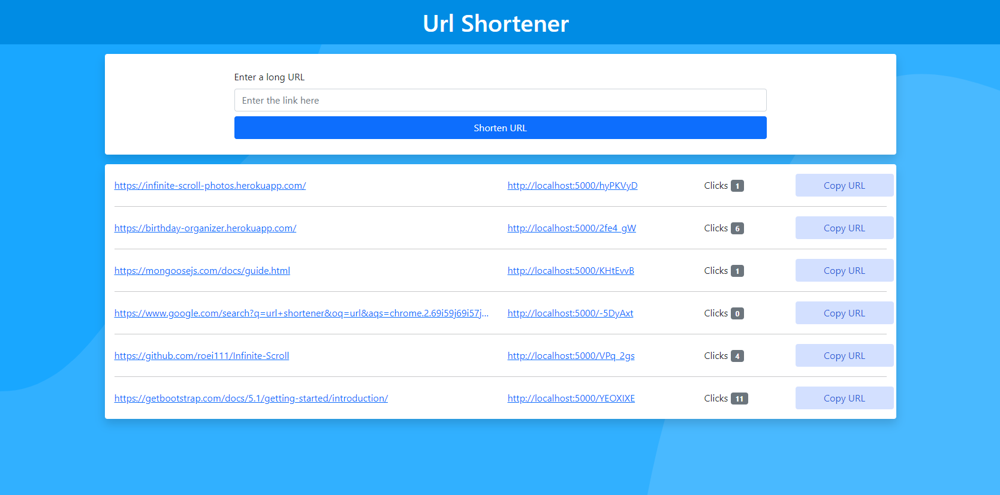

# Url-Shortener

<h4>A URL-Shortener created using Node.js, Express.js & MongoDB</h4>


<p align="center">
   
  
  
</p>


https://user-images.githubusercontent.com/71691473/187525165-c3d88c95-296b-4ea6-afe4-1144e7c78bb9.mp4


## Features

- Shorten a Long URL using the web app
- Track the number of clicks
- Full responsive

## Technologies

- Node.js
- Express.js
- MongoDB
- Mongoose
- Ejs
- Bootstrap

## Usage

### Env Variables

Create a .env file in the root folder and add the following

```
DB_URL = your mongodb url
URL = the url of your app
SECRET = your own string
```
### Install Dependencies (Client & Server)

```
npm install
```

### Run

```
npm start
```

