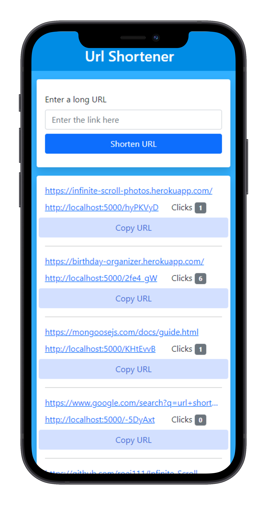
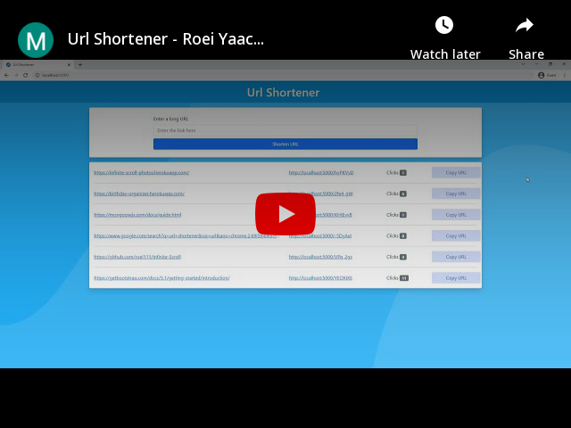

# Url-Shortener

<h4>A URL-Shortener created using Node.js, Express.js & MongoDB</h4>


<p align="center">
  
</p>
<p align="center">
  <a href="https://youtu.be/iIN-IuodrzM" target="_blank" rel="noopener noreferrer"></a>
</p>


## Features

- Shorten a Long URL using the web app
- Track the number of clicks
- Full responsive

## Usage

### Env Variables

Create a .env file in the root folder and add the following

```
DB_URL = your mongodb url
URL = the url of your app
SECRET = your own string
```
### Install Dependencies (Client & Server)

```
npm install
```

### Run

```
npm start
```

